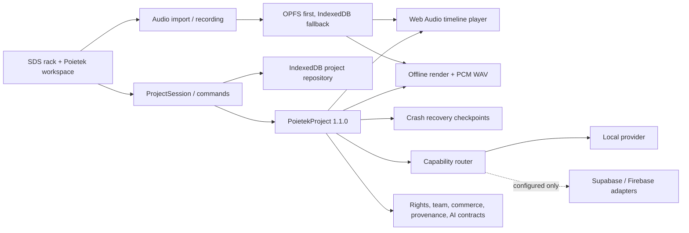

# Poietek Studio system architecture

Poietek is organized as a local-first creative system wrapped around the useful
SDS rack interface. The SDS components remain a presentation layer; durable
creative truth belongs to the versioned Poietek core.

## Active source map

```text
src/
├── App.tsx                    SDS rack shell and legacy workspaces
├── components/               Preserved hardware-inspired SDS UI
├── audio/ and midi/          Legacy live performance engines under migration
├── types/                    Legacy UI-only state contracts
└── poietek/                  Production runtime and canonical architecture
    ├── app/                  Runtime composition
    ├── domain/               Serializable project schema and validation
    ├── project/              Repository, autosave, undo and redo
    ├── assets/               OPFS/IndexedDB media and real audio import
    ├── audio/ and timeline/  Web Audio playback and musical time conversion
    ├── capture/              Capability-gated browser recording
    ├── export/               Offline rendering and honest PCM WAV export
    ├── recovery/             Recover, skip and discard checkpoints
    ├── health/ and release/  Basic PCM checks and destination readiness
    ├── player/               Time-preserving tuning DSP boundary
    ├── providers/            Provider-neutral capability routing
    ├── settings/             Versioned global preferences and portable profiles
    ├── library/              Original modules, content and availability catalog
    ├── diagnostics/          Evidence-based local benchmark
    ├── ai/                   Local assistant, provider catalog and policy
    ├── hardware/             Device, routing, sync and measurement contracts
    ├── community/            Hub, release and tuning destination contracts
    ├── platform/             Collaboration, rights, provenance, commerce,
    │                         privacy, learning, interoperability, plugin,
    │                         video/VFX and AI contracts
    ├── deployment/           Local/PWA/native deployment capability model
    ├── vision/               Traceable product capability catalog
    ├── pwa/                  Install/offline shell integration
    └── react/                Unified Arrange/Rack shell, Horizon arranger,
                              Summit console, setup and SDS bridge
```

The public API for production modules is `src/poietek/index.ts`. Subsystems may
still import nearby implementation files internally, but new application code
should prefer the public barrel when practical.

## Runtime boundaries



The immediate success condition is a durable local commit. Cloud sync, AI,
registration, blockchain evidence, payments and federation are asynchronous and
optional. No external provider is allowed to make the editor unusable offline.

## Unified studio presentation

The main window now opens into the canonical **Arrange** desk. **Rack** remains a
first-class area rather than a modal prototype; F7 selects Arrange and F6 selects
Rack. The visual system is original but combines useful interaction principles:

- track selection connects clips, mixer state and eventual per-track rack chains;
- the Horizon arranger reads actual `PoietekProject` clips and stored waveform
  previews;
- the Summit console commits gain, panorama, mute and solo through
  `ProjectSession`, so those controls affect Web Audio playback and undo/redo;
- insert, send, meter and record-arm surfaces are explicitly bypassed or
  unavailable until an adapter supplies real processing or measurement;
- the SDS hardware rack, rear patching, device folding and detachable workspaces
  remain available while their durable state is progressively migrated.

Clip position, duration trim, gain, panorama, fades, mute, split and removal are
validated pure operations. Fade envelopes are scheduled on the actual Web Audio
gain node. Removing a clip retains its source asset for safety.

## Truth and capability rules

- `PoietekProject` is JSON-serializable. `AudioBuffer`, streams, MIDI ports and
  native handles are never stored in it.
- RMS/sample peak are not labelled LUFS/dBTP. Standards fields remain
  `not_measured` until a validated analyzer exists.
- A432/A440 derivative playback requires the time-preserving DSP contract. It
  never silently uses `playbackRate`.
- Device latency and hardware profiles remain unmeasured/unverified until a real
  loopback, trusted driver report or explicit user selection supplies evidence.
- Rights approval, registration acceptance, payment settlement and blockchain
  anchoring remain explicit external states with evidence; the app cannot invent
  them.
- Provider secrets are not exposed through Vite client variables.

## Native and web targets

The same canonical project format is used by the browser/PWA and the Tauri shell.
The current Tauri directory is intentionally a least-privilege scaffold: no IPC
commands or plugins, restrictive CSP, and bundling disabled until real native
adapters, icons, signing and platform tests are complete.

## Controlled architecture set

This overview is read with the following controlled documents:

- `volumes/README.md` indexes the fourteen professional volumes for product,
  engineering, audio, hardware, video/VFX, AI, platform, rights, cloud, API,
  interface, SDK, security and release audiences.
- `POIETEK_MASTER_SPECIFICATION.md` defines vision, philosophy, capability
  domains, users, permissions, workflows and status language.
- `UI_SCREEN_WORKFLOW_CATALOG.md` inventories screens, global menus, settings,
  operational controls, responsive behavior and tutorials.
- `PLATFORM_DATA_API_SECURITY_BLUEPRINT.md` defines data ownership, local and
  remote schemas, command/event/API boundaries, AI, providers, SDKs, protocols,
  trust zones and security requirements.
- `DELIVERY_TEST_DOCUMENTATION_PLAN.md` maps the definition into web, PWA,
  desktop, mobile, backend and cloud workstreams with phase exit gates.

These documents are specifications, not automatic implementation claims. Their
status labels must agree with code, adapters, tests and visible unavailable
states.

## Archive policy

Only runtime source, tests, documentation and reproducible configuration belong
in the active repository. Generated `dist`, compiled test output and
`node_modules` are ignored and can be rebuilt. Historical ZIPs, chat exports,
partial mirrors and dependency-recovery staging belong outside this active tree
in a dated archive with a manifest and checksums. They must never be unpacked
into `src`.
