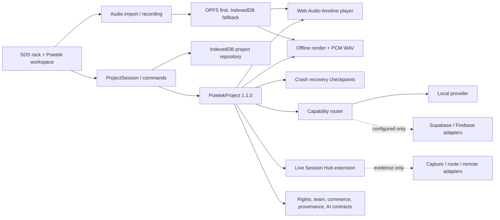

# Poietek Studio system architecture

The detailed scale, security, reliability, data, API, media, AI, deployment and
adoption target is defined in
[`WORLD_CLASS_SYSTEM_ARCHITECTURE.md`](WORLD_CLASS_SYSTEM_ARCHITECTURE.md). This
file remains the concise map of the architecture implemented in the repository.

Poietek is organized as a local-first creative system wrapped around the useful
SDS rack interface. The SDS components remain a presentation layer; durable
creative truth belongs to the versioned Poietek core.

## Active source map

```text
src/
├── App.tsx                    SDS rack shell and legacy workspaces
├── components/               Preserved hardware-inspired SDS UI
├── audio/ and midi/          Legacy live performance engines under migration
├── types/                    Legacy UI-only state contracts
└── poietek/                  Production runtime and canonical architecture
    ├── app/                  Runtime composition
    ├── domain/               Serializable project schema and validation
    ├── project/              Repository, autosave, undo and redo
    ├── assets/               OPFS/IndexedDB media and real audio import
    ├── audio/ and timeline/  Web Audio playback and musical time conversion
    ├── capture/              Capability-gated browser recording
    ├── export/               Offline rendering and honest PCM WAV export
    ├── recovery/             Recover, skip and discard checkpoints
    ├── health/ and release/  Basic PCM checks and destination readiness
    ├── player/               Time-preserving tuning DSP boundary
    ├── providers/            Provider-neutral capability routing
    ├── settings/             Versioned global preferences and portable profiles
    ├── library/              Original modules, content and availability catalog
    ├── diagnostics/          Evidence-based local benchmark
    ├── production-workflows/ Score, monitor, post, spectral, offline,
    │                         immersive, mastering, remote-session and live
    │                         capture/soundcheck coordination models
    ├── composition-workflows/Patterns, mixed lanes, note transforms,
    │                         automation, recall intent, loop drafts, song
    │                         variants, lyrics and validated track-scene recall
    ├── engines/comping.ts    Aligned real-audio take discovery, validated
    │                         segment plans and atomic canonical comp commits
    ├── performance-workflows/Project-owned scene/slot launch intent,
    │                         quantized rehearsal capture, runtime evidence
    │                         gates and atomic arrangement commit
    ├── region-workflows/     Exact project-owned audio, arrangement and
    │                         automation membership; deterministic whole-section
    │                         move/copy plans and atomic project commands
    ├── ai/                   Local assistant, provider catalog and policy
    ├── hardware/             Device, routing, sync and measurement contracts
    ├── community/            Hub, release and tuning destination contracts
    ├── platform/             Collaboration, rights, provenance, commerce,
    │                         privacy, learning, interoperability, plugin,
    │                         video/VFX and AI contracts
    ├── deployment/           Local/PWA/native deployment capability model
    ├── vision/               Traceable product capability catalog
    ├── pwa/                  Install/offline shell integration
    └── react/                Unified Arrange/Rack shell, Horizon arranger,
                              Summit console, setup and SDS bridge
```

The public API for production modules is `src/poietek/index.ts`. Subsystems may
still import nearby implementation files internally, but new application code
should prefer the public barrel when practical.

`native-core/` is the portable C++20 real-time/DSP kernel. It exposes a narrow,
versioned C ABI to Rust/Tauri and future mobile hosts; it never owns project
documents, UI state, credentials or provider workflows. This preserves a native
foundation where deterministic performance matters without duplicating the safer
domain and application layers.

## Runtime boundaries



The immediate success condition is a durable local commit. Cloud sync, AI,
registration, blockchain evidence, payments and federation are asynchronous and
optional. No external provider is allowed to make the editor unusable offline.

## Unified studio presentation

The main window now opens into the canonical **Arrange** desk. **Rack** remains a
first-class area rather than a modal prototype; F7 selects Arrange and F6 selects
Rack. The visual system is original but combines useful interaction principles:

- track selection connects clips, mixer state and eventual per-track rack chains;
- the Horizon arranger reads actual `PoietekProject` clips and stored waveform
  previews;
- the Summit console commits gain, panorama, mute and solo through
  `ProjectSession`, so those controls affect Web Audio playback and undo/redo;
- insert, send, meter and record-arm surfaces are explicitly bypassed or
  unavailable until an adapter supplies real processing or measurement;
- the SDS hardware rack, rear patching, device folding and detachable workspaces
  remain available while their durable state is progressively migrated.

Clip position, duration trim, gain, panorama, fades, mute, split and removal are
validated pure operations. Fade envelopes are scheduled on the actual Web Audio
gain node. Removing a clip retains its source asset for safety.

## Truth and capability rules

- `PoietekProject` is JSON-serializable. `AudioBuffer`, streams, MIDI ports and
  native handles are never stored in it.
- RMS/sample peak are not labelled LUFS/dBTP. Standards fields remain
  `not_measured` until a validated analyzer exists.
- A432/A440 derivative playback requires the time-preserving DSP contract. It
  never silently uses `playbackRate`.
- Device latency and hardware profiles remain unmeasured/unverified until a real
  loopback, trusted driver report or explicit user selection supplies evidence.
- Rights approval, registration acceptance, payment settlement and blockchain
  anchoring remain explicit external states with evidence; the app cannot invent
  them.
- Provider secrets are not exposed through Vite client variables.

## Native and web targets

The same canonical project format is used by the browser/PWA and the Tauri shell.
The Tauri directory remains least privilege: it has a restrictive CSP and one
application command permission for read-only CPAL/midir audio and MIDI endpoint
inventory. Bundling and icons are configured. The command opens no stream or
MIDI connection and exposes no filesystem, shell, network or provider access.
Native realtime routing, signing and physical platform tests remain separate
release gates; see `NATIVE_DEVICE_IO.md`.

### One app, active-device presentation

`deployment/deviceProfile.ts` derives a versioned, session-local runtime profile
from viewport, orientation, touch points, pointer/hover evidence and the current
browser, installed or native surface. `useDeviceRuntimeProfile` observes changes
and applies the active profile to the shared application shell.

Desktop receives the expanded professional workspace, touch or hybrid tablets
receive compact chrome and touch-safe controls, and phones receive a handheld
workspace with persistent bottom navigation. A phone remains mobile in landscape;
a narrow desktop window can use the handheld layout without falsely identifying
the hardware as a phone. Unidentified access points use the conservative compact
profile.

This device profile is deliberately not stored in `PoietekProject`. The project,
assets, rights and release data remain portable creative truth; presentation and
available-device capabilities remain local to the active access point. See
`DEVICE_AWARE_ACCESS.md` for the complete detection and acceptance matrix.

## Canonical MIDI idea and variation boundary

`MidiClipRecord` objects live in the versioned production-engine extension and
reference canonical MIDI or instrument tracks. `Note Forge MIDI Lab` is the first
operational editor for that store. It creates starter clips, computes deterministic
generator/transform previews without mutation, and commits a new output clip plus
an applied transformation record through `ProjectSession`. Source clips are never
overwritten by a variation commit.

The available local clip capability is intentionally narrower than a real-time MIDI
engine. Its evidence metadata declares playback, retrospective input capture and
network sync false. MPE, clock output, external scheduling, Link, hardware handoff,
notation rendering and MusicXML remain separate fail-closed capabilities. This keeps
serializable creative work reusable by the scoring and performance layers without
allowing a rack UI to masquerade as an observed audio/MIDI runtime.

## Score techniques and instrument-switch intent

The `org.poietek.performance-techniques` extension is the provider-neutral bridge
between the canonical score and future instrument adapters. Schema 1.0 owns typed
direction/attribute techniques, mutual-exclusion groups, normalized score bindings,
exact sound slots, MIDI trigger intent, player/track assignments and committed plan
records. It supplements rather than rewrites the earlier score articulation strings
and production-engine MIDI clip records.

`planProjectTechniquePlayback` is pure. It validates the score, map and assignment,
converts measure/beat positions with the canonical PPQ, models persistent directions
and one-note attributes, requires an exact slot and returns reviewable trigger ticks.
`commitProjectTechniquePlan` re-derives the complete plan from current project truth
and refuses stale or duplicate operations before recording `planned_for_adapter`.
The commit does not modify score notes, create clips, touch media or claim MIDI/audio
execution. Live scheduling, plug-in hosting, audible rendering and third-party map
interchange remain separate observed-adapter boundaries.

## Editorial memory and exact clip cohorts

The versioned `org.poietek.editorial-memory` extension keeps precision-editing
context out of transient component state. It owns typed point/range/view memories,
the active saved selection, track-focus pins, exact audio clip references and an
auditable editorial operation history. Arrange reads the pin state and deterministically
orders pinned tracks before unpinned tracks while preserving canonical track order
inside both groups.

Clip-group capture accepts only real audio clips fully contained by the creator's
range; a boundary that cuts through a clip fails before mutation. Batch display-name
plans are pure and carry their source names. Apply revalidates every source name so a
stale preview cannot overwrite newer work, changes only canonical clip display names,
preserves Asset IDs, hashes, original asset names and disk files, and becomes one
`ProjectSession` undo point. Disk rename/relink, AAF/OMF parsing, speech models, AAX
hosting, EUCON/HDX and immersive rendering remain independent licensed/native adapters.

## Controlled architecture set

The versioned unified-production extension is the orchestration boundary for a
complete programme: score, MIDI, audio, picture, VFX, captions, rights, master,
Poietek TV session, selected community release and marketplace licence all point
back to one canonical project. It composes the platform/community/hardware
extensions and does not create a second project store. See
`UNIFIED_PRODUCTION_PLATFORM.md` and `GOVERNANCE_LEGAL_HELP_PACK.md`.

This overview is read with the following controlled documents:

- `volumes/README.md` indexes the fourteen professional volumes for product,
  engineering, audio, hardware, video/VFX, AI, platform, rights, cloud, API,
  interface, SDK, security and release audiences.
- `POIETEK_MASTER_SPECIFICATION.md` defines vision, philosophy, capability
  domains, users, permissions, workflows and status language.
- `UI_SCREEN_WORKFLOW_CATALOG.md` inventories screens, global menus, settings,
  operational controls, responsive behavior and tutorials.
- `PLATFORM_DATA_API_SECURITY_BLUEPRINT.md` defines data ownership, local and
  remote schemas, command/event/API boundaries, AI, providers, SDKs, protocols,
  trust zones and security requirements.
- `DELIVERY_TEST_DOCUMENTATION_PLAN.md` maps the definition into web, PWA,
  desktop, mobile, backend and cloud workstreams with phase exit gates.

These documents are specifications, not automatic implementation claims. Their
status labels must agree with code, adapters, tests and visible unavailable
states.

## Archive policy

Only runtime source, tests, documentation and reproducible configuration belong
in the active repository. Generated `dist`, compiled test output and
`node_modules` are ignored and can be rebuilt. Historical ZIPs, chat exports,
partial mirrors and dependency-recovery staging belong outside this active tree
in a dated archive with a manifest and checksums. They must never be unpacked
into `src`.
