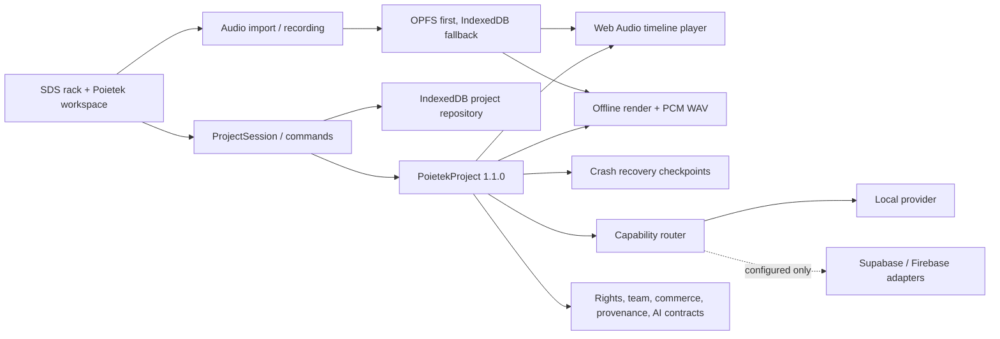

# Poietek Studio system architecture

Poietek is organized as a local-first creative system wrapped around the useful
SDS rack interface. The SDS components remain a presentation layer; durable
creative truth belongs to the versioned Poietek core.

## Active source map

```text
src/
├── App.tsx                    SDS rack shell and legacy workspaces
├── components/               Preserved hardware-inspired SDS UI
├── audio/ and midi/          Legacy live performance engines under migration
├── types/                    Legacy UI-only state contracts
└── poietek/                  Production runtime and canonical architecture
    ├── app/                  Runtime composition
    ├── domain/               Serializable project schema and validation
    ├── project/              Repository, autosave, undo and redo
    ├── assets/               OPFS/IndexedDB media and real audio import
    ├── audio/ and timeline/  Web Audio playback and musical time conversion
    ├── capture/              Capability-gated browser recording
    ├── export/               Offline rendering and honest PCM WAV export
    ├── recovery/             Recover, skip and discard checkpoints
    ├── health/ and release/  Basic PCM checks and destination readiness
    ├── player/               Time-preserving tuning DSP boundary
    ├── providers/            Provider-neutral capability routing
    ├── platform/             Collaboration, rights, provenance, commerce,
    │                         privacy, learning, interoperability, plugin,
    │                         video/VFX and AI contracts
    ├── pwa/                  Install/offline shell integration
    └── react/                Production project/audio workspace and SDS bridge
```

The public API for production modules is `src/poietek/index.ts`. Subsystems may
still import nearby implementation files internally, but new application code
should prefer the public barrel when practical.

## Runtime boundaries



The immediate success condition is a durable local commit. Cloud sync, AI,
registration, blockchain evidence, payments and federation are asynchronous and
optional. No external provider is allowed to make the editor unusable offline.

## Truth and capability rules

- `PoietekProject` is JSON-serializable. `AudioBuffer`, streams, MIDI ports and
  native handles are never stored in it.
- RMS/sample peak are not labelled LUFS/dBTP. Standards fields remain
  `not_measured` until a validated analyzer exists.
- A432/A440 derivative playback requires the time-preserving DSP contract. It
  never silently uses `playbackRate`.
- Device latency and hardware profiles remain unmeasured/unverified until a real
  loopback, trusted driver report or explicit user selection supplies evidence.
- Rights approval, registration acceptance, payment settlement and blockchain
  anchoring remain explicit external states with evidence; the app cannot invent
  them.
- Provider secrets are not exposed through Vite client variables.

## Native and web targets

The same canonical project format is used by the browser/PWA and the Tauri shell.
The current Tauri directory is intentionally a least-privilege scaffold: no IPC
commands or plugins, restrictive CSP, and bundling disabled until real native
adapters, icons, signing and platform tests are complete.

## Archive policy

Only runtime source, tests, documentation and reproducible configuration belong
in the active repository. Generated `dist`, compiled test output and
`node_modules` are ignored and can be rebuilt. Historical ZIPs, chat exports,
partial mirrors and dependency-recovery staging belong outside this active tree
in a dated archive with a manifest and checksums. They must never be unpacked
into `src`.
