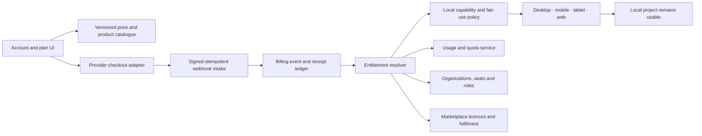

# Poietek business tier and monetization architecture

Status: **reference template — not an approved price book or live commercial offer**

Source imported on 2026-08-14 from the user-supplied Complete Master
Specification tier reference:

- 191 lines / 11,454 normalized characters;
- SHA-256 `80e5a16154b05ea09271a1ce817d251225c0487e7d5cb5a2c7586545f58f45ef`;
- machine-readable catalogue: `src/poietek/business/catalog.ts`;
- schema: `src/poietek/business/contracts.ts`, version 1.0.0.

The prices below preserve the supplied business shape so it can be evaluated.
They are not final prices, quotes, checkout values or app-store products.

## Reference tier structure

| Order | Tier | Commercial shape | Imported reference | Intended audience |
| ---: | --- | --- | ---: | --- |
| 1 | Free Forever | Free local entry | £0 | Evaluation, learning and local creation |
| 2 | Creator Perpetual | One-time major-version licence | £199–£599 | Creators preferring perpetual local software |
| 3 | Basic Membership | Individual subscription | £12/month | Modest online allowances without collaboration |
| 4 | Pro Membership | Professional subscription | £22/month | Collaboration, rights preparation and online services |
| 5 | Premium Membership | Advanced subscription | £32/month | Broader collaboration, support and early access |
| 6 | Teams Membership | Per-user subscription | £32/user/month | Studios, labels, educators and managed groups |
| 7 | Enterprise | Negotiated contract | From £500/month | Dedicated deployment, support, branding and compliance scope |

## Non-negotiable commercial rules

1. Local durable creation is the success condition. A provider, billing or
   network outage cannot make a user's local project inaccessible merely because
   an online entitlement cannot be refreshed.
2. A catalogue record describes proposed entitlement policy; it never proves an
   account owns that entitlement or that a runtime capability is available.
3. Purchased marketplace items survive subscription cancellation only when the
   approved item licence grants a perpetual entitlement.
4. High-volume AI, storage, collaboration and marketplace access require a
   published fair-use policy, provider budget, capacity controls and abuse
   handling. The word “unlimited” is not a technical or contractual boundary.
5. A rights pathway helps collect evidence and reach an external authority. It
   cannot clear a sample, register a work, accept a split or provide legal advice
   by itself.
6. Payment initiation is not settlement. Fulfilment requires signed provider
   evidence, an idempotent order transition and a durable receipt.
7. Billing administration, organization administration and project ownership are
   separate permissions. Buying a seat never grants access to creative content.
8. Early-access software is isolated from stable projects and cannot be described
   as production availability.
9. A support priority is not an SLA. An SLA exists only through an approved
   contract with targets, exclusions, hours and remedies.
10. Commercial terms, refunds, taxes, consumer rights, store rules and privacy
    obligations are reviewed per launch region and distribution channel.

## Entitlement interpretation

| State | Meaning |
| --- | --- |
| `included` | Proposed as part of the tier; runtime capability is still checked separately. |
| `limited` | A reference allowance exists and has an explicit count, period and enforcement boundary. |
| `not_included` | The tier intentionally excludes the online entitlement; local export or file sharing may still exist separately. |
| `add_on` | Separately licensed content or service under its own terms. |
| `requires_provider` | Cannot operate until a configured service reports real availability. |
| `configurable` | Requires a price-book, contract or owner decision before sale. |

Inheritance is explicit: Premium extends Pro; Teams extends Premium; Enterprise
extends Teams. Basic does not silently inherit Creator because the source does not
define that relationship. Export rights for Basic and Pro therefore remain an
open decision rather than an invented promise.

## Required service architecture



The browser and shared frontend never receive provider secrets. Payment sessions
are created through a secure backend or native authorization boundary. Webhooks
are signature-verified, replay-protected and idempotent. Entitlement snapshots
are signed, short-lived and cached only for the approved offline grace period.

## Controlled data model

The production backend requires versioned records for:

- products, prices, currencies, regions, channels and effective dates;
- accounts, organizations, memberships, seats and least-privilege roles;
- subscriptions, perpetual licences, add-ons and marketplace item licences;
- entitlements, limits, usage periods, reservations and adjustments;
- checkout sessions, provider customers, invoices, tax evidence and receipts;
- payment, refund, cancellation, dispute and chargeback events;
- signed provider webhook envelopes and idempotency keys;
- local entitlement snapshots, grace expiry and restore-purchase evidence;
- marketplace listings, licence versions, orders, fulfilment and seller payouts;
- support plans and contracted service levels;
- consent, audit, retention, deletion and subject-access records.

Raw payment-card data, wallet seed phrases, provider secrets and private keys are
never application records. Creative projects and media stay local-first or in the
user's selected storage; service data is minimized, encrypted and purpose-bound.

## Payment and fulfilment state boundary

```text
catalogue reference
  → approved product and price
  → checkout session requested
  → provider payment pending
  → provider event received and signature verified
  → payment settled or rejected
  → entitlement granted or revoked
  → fulfilment recorded
  → receipt available
```

Refund, cancellation, chargeback and dispute events create new auditable state;
they do not rewrite history. Optional blockchain receipts are evidence only and
are not a substitute for the payment provider, contract, licence or applicable
law.

## Legal and policy corrections required before launch

The reference contains valuable intent but several claims require professional
review or narrower language:

- “zero knowledge” is not established merely by storing little data. Identity,
  collaboration, billing, support and provider metadata still require a complete
  data map and threat model;
- hashes of identity or consent recordings may remain personal data, and liveness
  processing can invoke biometric/privacy obligations even when source video is
  deleted;
- a platform cannot assume every tax, withholding, marketplace or consumer duty
  belongs solely to the user;
- copyright ownership cannot safely default from a project role without an
  applicable signed agreement and jurisdictional review;
- AI split suggestions are non-authoritative proposals that require informed
  human agreement;
- “lifetime access” requires an explicit lifetime definition, durable storage,
  succession, deletion, portability and service-termination policy;
- escrow, mediation, automatic royalties and smart-contract payouts require
  licensed providers, dispute rules, sanctions/fraud controls and legal review;
- an acknowledgement of uncleared material records a user's decision but does
  not remove platform or third-party obligations.

## Decisions still open

1. Final names, prices, currencies, billing intervals and launch regions.
2. Product inheritance between Creator, Basic and Pro.
3. Trial, renewal, cancellation, refund, chargeback and offline grace policy.
4. Merchant of record, app-store billing, invoicing and tax provider.
5. Exact AI, storage and collaboration fair-use limits and cost budgets.
6. Project, asset, team and account retention/deletion rules.
7. Marketplace commission, payout schedule, refund allocation and seller checks.
8. Perpetual upgrade, compatibility and end-of-support policy.
9. Support levels, response targets, escalation and enterprise remedies.
10. Whether optional crypto payments or evidence anchoring ship on each platform.

## Delivery phases

| Phase | Deliverable | Exit condition |
| --- | --- | --- |
| B0 | Reference catalogue | Seven tiers are versioned, validated, visible and explicitly non-live. |
| B1 | Approved price book | Owner and legal review approve products, inheritance, regions, tax and terms. |
| B2 | Local licence foundation | Signed perpetual licence, restore and offline grace pass clock/revocation tests. |
| B3 | Subscription adapter | Sandbox checkout, webhook, renewal, cancellation, refund and receipt tests pass. |
| B4 | Entitlement and usage | Server-authoritative grants, quotas, fair use, outage and abuse tests pass. |
| B5 | Teams | Organizations, seats, roles, invitations, audit and billing separation pass. |
| B6 | Marketplace | Listing licences, orders, payment evidence, fulfilment, refunds and payouts pass. |
| B7 | Enterprise | Contract-specific security, deployment, support and compliance acceptance passes. |

The current build completes **B0 only**. It does not contain live checkout,
subscriptions, payment settlement, seller payouts, remote entitlements or an
approved commercial offer.
