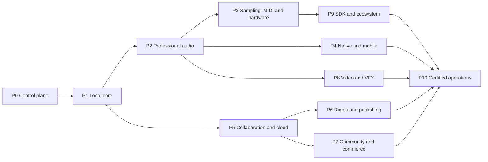

# Poietek delivery, testing and documentation plan

## 1. Purpose and control

This plan converts the controlled product definition in
`POIETEK_MASTER_SPECIFICATION.md` into shippable software and evidence. It does
not claim that a named capability exists merely because it appears in the plan.
Every release must use the shared status vocabulary: **operational**,
**foundation**, **prototype**, **planned**, **external gate**, **unavailable** or
**retired**.

The implementation order is deliberately local-first. A saved local project and
its media must remain useful when cloud, identity, AI, payment, registration and
community services are unavailable.

## 2. Derived delivery set

| Deliverable | Controlled source | Required output | Current repository evidence |
| --- | --- | --- | --- |
| Product definition | Master specification | Versioned requirements and status ledger | `POIETEK_MASTER_SPECIFICATION.md` |
| Software architecture | Domain and workflow requirements | Boundaries, dependency rules and trust zones | `ARCHITECTURE.md`, `PLATFORM_DATA_API_SECURITY_BLUEPRINT.md` |
| UI designs | Screen, menu, control and workflow catalog | Responsive layouts, component states and interaction specifications | `UI_SCREEN_WORKFLOW_CATALOG.md` plus implemented React/CSS |
| Database schema | Canonical ownership and remote projections | Local stores, relational schema, migrations and retention | `PLATFORM_DATA_API_SECURITY_BLUEPRINT.md` |
| API documentation | Commands, events, native bridge and remote routes | OpenAPI/AsyncAPI/native contract generated from validated schemas | Blueprint defined; generation planned |
| AI architecture | AI safety and provider requirements | Local orchestrator, provider adapters, policy gates, provenance and evals | Core contracts/catalog operational; full service planned |
| Backend | Remote workflows only | Identity, sync, assets, collaboration, rights, release, community and commerce services | Contracts present; services not claimed |
| Frontend | Screen and workflow catalog | Desktop-density studio, responsive touch shell and accessible web portal | Arrange/Rack/Setup slice operational; catalog remainder staged |
| Desktop apps | Native requirements | Signed Tauri packages and native device/storage/dialog adapters | Least-privilege scaffold; installers gated |
| Mobile apps | Responsive and native requirements | Android/iOS projects, touch workflows, background/resume tests | Commands scaffolded; platform init/signing gated |
| Web application | PWA and portal requirements | Browser editor, installable PWA and optionally hosted portal | Production web build and local PWA shell operational |
| Cloud services | Provider-neutral service boundaries | Deployable services, storage, queues, observability and recovery | Router/contracts operational; deployments gated |
| Deployment | Environment and security rules | Reproducible local, preview, staging and production releases | Local scripts operational; public release pipeline planned |
| Testing | Requirement IDs and phase gates | Automated, hardware, security, accessibility and acceptance evidence | Core/unit/build verification operational; specialist suites staged |
| Documentation | User and developer audiences | User guide, tutorials, administration, API/SDK and release records | Controlled architecture set established; manuals staged |

## 3. Software workstreams

### 3.1 Shared production core

- Own the versioned, serializable project model, migrations and validation.
- Expose commands rather than allowing views to mutate durable state directly.
- Keep audio buffers, device handles, streams, provider clients and secrets out
  of project JSON.
- Preserve deterministic undo/redo and serialized autosave around every durable
  edit.
- Attach optional versioned extensions for hardware, collaboration, rights,
  community and future domains; unknown versions remain safely unsupported.

### 3.2 Frontend and interaction system

- Use one transport, one project command path and one selected-track source of
  truth across Arrange, Rack, Mixer, Sampler, MIDI, Video and VFX workspaces.
- Maintain desktop density while providing touch-sized controls, compact
  navigation and layout persistence for tablets and phones.
- Give every asynchronous action visible idle, pending, success, empty,
  unavailable, permission-denied, offline and error states.
- Keep unimplemented commands visible only when their disabled state teaches the
  user what adapter, permission or phase is missing.
- Store design tokens, focus behavior, shortcuts and control semantics centrally.

### 3.3 Local/native services

- Browser/PWA: IndexedDB project data, OPFS-first media, Web Audio, Web MIDI,
  MediaRecorder and capability-aware file/device access.
- Desktop: Tauri commands limited to explicit dialogs, filesystem roots, secure
  credentials, native audio/MIDI adapters, plugin scanning and installer update
  operations. Each command receives a narrow capability grant.
- Mobile: platform media sessions, microphone permission, safe app storage,
  interruptions, route changes, background/resume and constrained editing.
- Native failure must degrade to the browser/local contract without corrupting
  project data or presenting unsupported low-latency claims.

### 3.4 Remote backend

Remote services are projections and coordination layers, not the owner of the
creative project format. Planned independently deployable boundaries are:

1. Identity, organisations, roles, sessions and device registration.
2. Project change log, replica cursors, conflict resolution and snapshots.
3. Encrypted asset upload, object manifests, resumable transfer and retention.
4. Presence, review, comments, invitations and approval trails.
5. Contributor passports, split proposals, evidence and agreements.
6. Release destinations, registration submissions, receipts and status polling.
7. Community profiles, feed, media, moderation, reporting and federation.
8. Catalog, licences, orders, settlement evidence, fulfilment and royalty ledger.
9. AI routing, job queues, budgets, consent, provenance and provider audit.
10. Notification preferences, webhooks and delivery receipts.

Supabase, Firebase or another implementation may back these boundaries, but no
provider-specific object may leak into the canonical project or public SDK.

### 3.5 Audio, graphics and media engines

- The real-time audio graph owns scheduling, routing, meters, inserts, sends,
  buses, monitoring and transport synchronization.
- Offline render owns reproducible export and must never depend on wall-clock
  playback.
- Standards analysis requires validated BS.1770 loudness and true-peak fixtures;
  until then those fields remain `not_measured`.
- Graphics use progressive waveform detail, cache invalidation, viewport
  virtualization and worker/off-main-thread preparation where available.
- Video/VFX use proxy media, frame/timecode synchronization, explicit render-job
  states and replaceable native/WASM backends.
- Time-preserving tuning derivatives require an actual DSP backend; changing
  playback rate is not an acceptable substitute.

## 4. Platform delivery matrix

| Target | Installation/use | Local capability | Online capability | Release gate |
| --- | --- | --- | --- | --- |
| Web portal | Visit an HTTPS URL | Browser storage and supported Web APIs | Optional sync, community, publishing and provider AI | CSP, privacy, browser matrix, service-worker upgrade and recovery tests |
| Installable PWA | Browser install/add to home screen | Cached shell, project/media storage and offline studio | Same provider-neutral services when connected | Offline reload, quota, eviction, update and permission tests |
| Windows desktop | Signed installer and application icon | Native files/devices/plugins plus web fallback | Optional remote services | Icons, code signing, updater, installer/uninstaller and device matrix |
| macOS desktop | Signed/notarized application | Native files/CoreAudio/CoreMIDI/plugins | Optional remote services | Signing, notarization, sandbox/entitlements and Apple Silicon/Intel policy |
| Linux desktop | Declared package formats | Native files/ALSA/PipeWire/JACK where adapters exist | Optional remote services | Distribution, library, audio-server and permission matrix |
| Android | Store or signed package | Touch studio, local media/audio/MIDI where supported | Optional remote services | SDK init, signing, route/interruption/background and device tests |
| iOS/iPadOS | Signed package | Touch studio, local media/audio/MIDI where supported | Optional remote services | SDK init, provisioning, audio-session, Files integration and device tests |

The local deployable edition is the primary one-terabyte workstation target. A
one-terabyte capacity is a storage deployment profile, not a promise that every
device has that storage. Quota, free-space and media-location checks must be
shown before import, recording, download or render.

## 5. Environments and deployment

### 5.1 Environments

- **Local development:** localhost only by default; synthetic fixtures clearly
  labelled; no production credentials.
- **LAN studio portal:** explicit opt-in binding, displayed interface address,
  authentication where the network is not trusted, and no silent exposure.
- **Preview:** disposable build, test identities/assets, short retention and no
  rights/payment claims.
- **Staging:** production-equivalent schemas, isolated credentials, migration and
  disaster-recovery rehearsal.
- **Production:** approved regions, key management, audit retention, alerting,
  backups, rollback and incident response.

### 5.2 Service and port policy

Ports are configuration, not product features. The web development and preview
scripts select documented ports; production web traffic terminates through
HTTPS. Native audio/MIDI/device communication uses platform APIs, not arbitrary
open network ports. Collaboration and provider APIs use authenticated HTTPS or
secure WebSocket connections. LAN listening always requires explicit user
action and a visible stop control.

### 5.3 Release artifacts

Every release candidate must produce a web bundle manifest, dependency and
licence inventory, test report, schema/migration record, changelog, known
limitations, signed native artifacts where applicable, hashes, provenance and a
rollback/recovery note. No artifact is published or pushed without explicit
authorization.

## 6. Testing and evidence matrix

| Test family | Required evidence | Principal failures caught |
| --- | --- | --- |
| Schema/unit | Validators, migrations and pure command tests | Invalid projects, invented claims, nondeterministic edits |
| Property/fuzz | Random project, timing, MIDI and envelope cases | Boundary corruption, overflow, malformed external input |
| Persistence/recovery | Save ordering, quota, interrupted writes, reopen, recover/skip/discard | Lost work, stale snapshots, orphaned media |
| Audio fixtures | Decode, waveform, scheduling, gain/pan/fades, render comparison | Phase cancellation, timing drift, graph mismatch |
| Standards conformance | Published/reference BS.1770 and true-peak vectors | False LUFS/dBTP reporting |
| Browser integration | Chromium, Firefox and WebKit capability matrices | API assumptions, storage/service-worker regressions |
| UI end-to-end | Every critical workflow and command state | Duplicate transports, broken menus, disconnected controls |
| Accessibility | Keyboard-only, focus order, labels, contrast, zoom, reduced motion, screen reader | Inaccessible studio operations |
| Responsive/touch | Phone, tablet, desktop and high-density layouts | Hidden controls, tiny targets, viewport traps |
| Performance | Startup, project open/save, waveform, play latency, memory, large track/asset counts | Jank, leaks, unbounded caches |
| Native | Command allowlist, dialogs, filesystem scopes, install/update/uninstall | Privilege expansion, packaging loss, path errors |
| Mobile | Permission, interruption, route, background/resume, low-memory cases | Recording loss, silent engine state, corrupt resume |
| MIDI/hardware | Recorded protocol fixtures and declared physical device matrix | Parser errors, false capabilities, clock/latency claims |
| Plugin | Scan sandbox, crash isolation, state recall, missing-plugin/freeze fallback | Host crashes, unrecoverable sessions, unsafe scanning |
| Security | Threat model, dependency/SBOM, static/dynamic scans, authz, tenant isolation, secret scan | Data exposure, privilege escalation, supply-chain risk |
| Privacy/compliance | Consent, export/delete, retention, age/region and processor evidence | Unlawful processing or misleading controls |
| Collaboration | Offline changes, ordering, conflicts, roles, revocation and audit | Lost edits, cross-tenant access, unauthorized publish |
| Rights/publishing | Proposal/acceptance evidence, receipts, retries and idempotency | Fabricated acceptance, double submission or payment |
| AI evaluation | Tool allowlists, prompt injection, data egress, quality/safety suites, undo | Silent mutation, secret leakage, unsupported certainty |
| Community/commerce | Moderation, report/appeal, licence/order/fulfilment evidence | Abuse, ownership invention, unproven settlement |
| Disaster recovery | Restore rehearsal, provider outage, region loss and local-only continuation | Unrecoverable services or offline lockout |

### 6.1 Performance benchmark profiles

Benchmarks record facts, not star ratings. Reports include hardware/browser/app
versions, sample rate, buffer request and accepted value, track/clip count,
decoder/render time, dropped frames, underruns, memory, storage and thermal state
when available. A device is never described as low-latency or professionally
verified without a declared measurement method and evidence.

### 6.2 Phase acceptance rule

A phase exits only when its required automated suites pass, manual/platform
evidence is attached, recovery is demonstrated, status labels match reality,
documentation is updated and known limitations are visible to users. A disabled
button or serializable contract is not completion of the underlying service.

## 7. Documentation system

### 7.1 Audience sets

- **Creator guide:** first launch, projects, recording, arranging, editing,
  sampling, MIDI, mixing, mastering, video/VFX, collaboration and export.
- **Quick starts and tutorials:** the EDU identifiers in the UI catalog, using
  accessible text, captions, transcripts, keyboard paths and downloadable demo
  projects made from original or properly licensed content.
- **Administrator guide:** organisations, roles, policies, storage, retention,
  providers, audit, moderation and incident response.
- **Hardware guide:** supported protocols, profile provenance, setup, clocking,
  calibration, troubleshooting and unsupported capability states.
- **Developer guide:** repository boundaries, commands, schemas, extension rules,
  tests, contribution standards and release process.
- **API/SDK reference:** generated OpenAPI/AsyncAPI/schema references, examples,
  authentication, scopes, rate limits, idempotency, errors and version policy.
- **Security/privacy center:** data map, encryption, subprocessors, consent,
  export/delete, reporting, advisories and support lifecycle.
- **Release record:** changelog, migrations, compatibility, known issues,
  deprecations, hashes and evidence links.

### 7.2 Documentation generation

Validated schemas and public command definitions will be the source for API and
SDK reference generation. The screen/command manifest will feed shortcut, menu
and accessibility references. Generated output is checked into release artifacts
only after human review; prose does not become true merely because it was
generated. Screenshots, audio examples and tutorials must be versioned against a
specific build.

## 8. Staged roadmap with exit gates

### P0 — controlled definition and repository

Deliver the source ledger, product philosophy, capability catalog, UI catalog,
architecture/data/API/security blueprints, archive rules and automated coverage
checks. Exit when all active code and documentation have an owner and status,
the build is reproducible and obsolete artifacts are outside the runtime tree.

### P1 — trustworthy local creative core

Deliver canonical project storage, media identity/storage, autosave, undo/redo,
import, waveform, timeline playback, settings/profiles, recovery and PWA offline
shell. Exit with interruption/quota/reopen tests and no cloud dependency.

### P2 — professional audio production

Deliver recording/monitoring, deep non-destructive editing, comping, automation,
inserts/sends/buses, metering, offline render, export matrix and validated
loudness/true-peak analysis. Exit with reference audio fixtures, large-session
benchmarks and recoverable missing-device/plugin behavior.

### P3 — sampling, MIDI, hardware and clocking

Deliver sampler workflows, original/licensed content, MIDI edit/route/clock,
explicit device profiles, loopback measurement, console/patch/transport adapters
and truthful clock-domain state. Exit against a published physical-device matrix.

### P4 — signed desktop and mobile applications

Deliver least-privilege native adapters, plugin hosting boundary, icons,
installers, updating and Android/iOS shells. Exit with platform signing,
install/update/uninstall, permissions, interruption and recovery evidence.

### P5 — cross-device collaboration and cloud services

Deliver encrypted identity, replicas, asset transfer, invitations, roles,
comments, review and conflict handling through provider-neutral adapters. Exit
with tenant-isolation, offline-merge, revocation, restore and provider-outage tests.

### P6 — contributor rights, registration and publishing

Deliver passports, split proposals, evidence, agreement acceptance, release
profiles and external submission/status adapters. Exit only with authority,
receipt, idempotency, audit and legal/compliance review; the app never self-asserts
external acceptance.

### P7 — community, learning, marketplace and commerce

Deliver profiles, feeds, media hub/player, federation choices, moderation,
learning paths, catalog, licences, orders, settlement evidence and royalty
statements. Exit with privacy, moderation, accessibility, payment and consumer
protection evidence.

### P8 — video, VFX and cross-modal production

Deliver proxy video editing, timecode, captions, colour, compositing/VFX jobs,
render backends and synchronized export. Exit with frame/audio sync, color,
caption/accessibility, render recovery and performance fixtures.

### P9 — AI, plugins, SDK and developer ecosystem

Deliver local assistant/tool orchestration, opt-in third-party/custom model
adapters, sandboxed plugin standards, public schemas, SDKs, examples and developer
portal. Exit with permission, provenance, egress, prompt-injection, crash-isolation,
compatibility and deprecation tests.

### P10 — certified public operations

Deliver production infrastructure, observability, support, backups, disaster
recovery, incident response, security/privacy/accessibility assessments and
signed releases across approved platforms. Exit requires operational evidence,
not a marketing comparison or an invented five-star score.

## 9. Change and completion control

Every issue, change or release should cite at least one `CAP`, `DOM`, `SCR`,
`SET`, `WF`, `SEC` or phase identifier. When implementation changes status, the
master specification, UI catalog, architecture, tests and user-facing unavailable
states are updated together. “World-class” is treated as an evidence program:
reliability, fidelity, speed, accessibility, recovery, security and workflow
quality must be measured against explicit acceptance criteria rather than copied
branding, proprietary content or unsupported claims.
