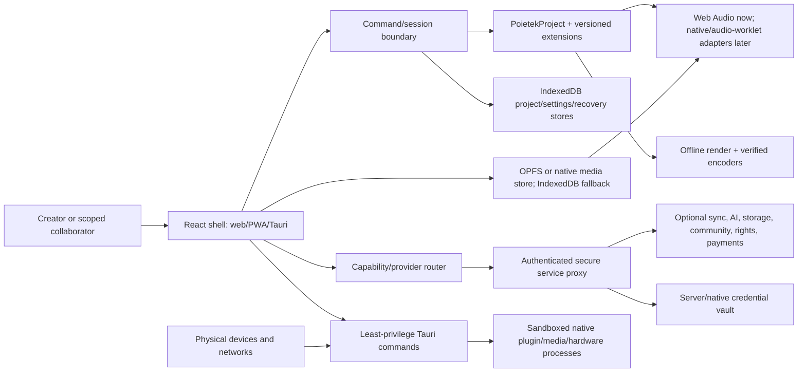
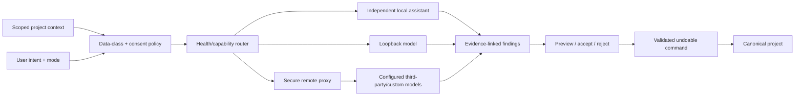

# Poietek platform, data, API and security blueprint

Document ID: `POI-PLATFORM-001`
Derived from: `POI-MASTER-001`
Scope: canonical data, local and remote databases, APIs, AI, cloud, hardware,
plugins, SDKs, security, privacy and operations.

## 1. System context and trust boundaries



Trust boundaries:

1. Browser/UI: untrusted inputs, no provider secrets, no direct privileged native
   or financial/legal operation.
2. Canonical local core: validated serializable state and deterministic commands.
3. Local media/native processes: large blobs, device handles, plugin processes and
   OS permissions; referenced by IDs only.
4. Secure service plane: authentication, authorization, secrets, rate limits,
   remote persistence and authoritative adapter observations.
5. External providers/authorities: never assumed available or authoritative
   beyond a scoped response with reference and observation time.

## 2. Canonical data ownership

### 2.1 Core project

`PoietekProject 1.1.0` owns project ID/title/version, creation/update times,
project settings, tuning reference, tempo map, asset metadata, tracks and clips.
Assets use SHA-256 identity plus stable IDs. Audio clips reference assets and store
musical time, source offset, duration, gain, pan, fades and mute. Tracks store type,
clips and mixer gain/pan/mute/solo.

The project does not own decoded buffers, media streams, MIDI ports, native file
handles, provider credentials, legal acceptance or payment settlement.

### 2.2 Versioned extensions

| Extension | Key/version | Owns |
| --- | --- | --- |
| Creative OS | versioned `org.poietek` extension | Creator identity, universal assets/replicas, graph, annotations, journal, intent lock, preflight, storage policy and handoff. |
| Platform foundation | `org.poietek.platform-foundation` / 1.0.0 | Collaboration, rights, evidence, commerce, privacy, learning, interchange, plugins, video/VFX and AI proposals. |
| Hardware foundation | versioned hardware extension | Profiles, provenance, adapter observations, patching, loopback/calibration, console/recall and clock domains. |

Unknown versions remain preserved and unsupported. Readers validate project ID,
schema version and content before use. Migrations are explicit, reversible where
possible, fixture-tested and never performed by blind object spreading.

## 3. Local database design

Logical local stores; physical IndexedDB databases may group them while preserving
transaction boundaries.

| Store | Key/indexes | Value | Retention/integrity |
| --- | --- | --- | --- |
| `projects` | project ID; updatedAt/title index | validated canonical project | Durable until user delete; serialized saves; migration version. |
| `assets` | asset ID; contentHash; project refs | Blob fallback and metadata | OPFS/native preferred for large media; hash verification; orphan grace period. |
| `waveforms` | asset ID + algorithm/block version | peak pyramid | Rebuildable cache, not source truth. |
| `recovery` | project ID + snapshot ID/time | validated snapshot and reason | Bounded by retention preference; Recover/Skip/Discard. |
| `settings` | fixed document key/profile ID | settings document/profiles | Local and versioned; export/import validation. |
| `ai-settings` | fixed document key/config ID | provider configuration without raw secret | Local; credential references only. |
| `ai-history` | project/request/time | requests, consent, findings/proposals | Off by policy or locally retained; deletion/export supported. |
| `changes` | project/revision/change ID | command/change envelope | Append-oriented; compacted with verified snapshot. |
| `outbox` | provider/job/createdAt | pending remote operation | Retry/backoff/idempotency; never blocks local commit. |
| `replicas` | asset/project + storage target | observation/hash/status | Observation time and repair policy. |
| `audit-local` | time/action/actor | privacy-safe local security/operation event | Bounded; paths redacted by default. |

OPFS/native paths are implementation details. Canonical records use logical asset
IDs and content hashes so media can move without rewriting creative meaning.

## 4. Remote relational schema

The remote schema is provider-neutral; PostgreSQL/Supabase is the reference
relational implementation. Firebase can implement equivalent documents/events but
must preserve authorization and evidence rules.

| Table/domain | Required columns/relations |
| --- | --- |
| `users` | `id`, status, created/updated; private identity data separated. |
| `organizations` / `organization_members` | organization, actor, role, status, authoritative membership evidence. |
| `projects` / `project_members` | owner/org, encrypted/current snapshot reference, revision, project role, timestamps. |
| `project_changes` | project, revision pair, actor, replica, command type, encrypted payload/digest, idempotency key, time. |
| `project_snapshots` | project, revision, schema version, digest, encrypted object/blob reference, time. |
| `assets` / `asset_replicas` | content hash, size/type/duration, owner/project; provider/storage reference, observed hash/status/time. |
| `comments` / `annotations` | project/asset/timeline target, author, visibility, body/content reference, state, moderation status. |
| `creator_profiles` / `follows` | selected public fields and visibility; relationship and block/mute state. |
| `feed_entries` | actor/source/target, visibility, moderation, lineage, createdAt. |
| `contributor_passports` / `identity_claims` | public identity claims separated from encrypted private/legal fields and authority evidence. |
| `split_proposals` / `split_shares` / `rights_acceptances` | work/version/status, basis points, role, participant evidence and supersession. |
| `agreements` / `agreement_acceptances` | agreement type/version/document asset and participant evidence. |
| `registrations` | work/type/provider, payload snapshot, local state and externally observed status. |
| `provenance_evidence` | subject/digest/kind/authority/reference/time; legal effect fixed to evidence-only. |
| `releases` / `release_renditions` / `deliveries` | project/version/destination, tuning/format/metadata, derivative lineage, preflight and external status. |
| `listings` / `orders` / `licence_receipts` | seller/asset/price/terms; purchaser/payment/fulfilment evidence and dispute state. |
| `consent_receipts` / `data_requests` | actor/scope/policy/decision/time and export/delete/correct lifecycle. |
| `provider_connections` | owner/provider/scopes/credential reference/status; secrets held outside application rows. |
| `moderation_reports` / `moderation_cases` / `appeals` | reporter/target/category/evidence, assigned operator, decision, policy version and audit. |
| `audit_events` | actor/session/action/target/result/policy/time/IP/device risk references; append-only and access-restricted. |

Row-level authorization is deny-by-default. Storage policies must mirror database
authorization. Public profile/feed projections must never query private identity,
rights or project tables directly.

## 5. API architecture

### 5.1 Internal command/event API

Current UI commands use `StudioCommandDetail` and the project session boundary.
Production commands require command ID/version, actor, project/base revision,
payload, createdAt, idempotency key and result/error envelope. Content commands
must validate the resulting project and enter undo history before persistence.

Core command families:

- project: create, open, save, delete, migrate, checkpoint, recover;
- asset: import, relink, verify, remove/orphan, route replica;
- track/clip: add/update/move/trim/split/remove/mixer/automation;
- transport/capture/export: play/pause/stop/seek, record session, render/export;
- hardware: discover, select profile, map, route, measure, recall with confirmation;
- platform: invite/member/role, change/comment/conflict, rights proposal/acceptance,
  registration, release/preflight/delivery, listing/order/dispute;
- AI: request, preview, accept, apply, reject, revoke consent and delete history.

Errors use a stable code, safe message, retryable flag, field issues, capability
state and correlation ID. User cancellation is distinct from failure.

### 5.2 Remote service API

Reference REST/JSON routes (a GraphQL or sync protocol adapter may coexist):

```text
POST   /v1/auth/sessions                         secure authentication exchange
GET    /v1/projects                              authorized project summaries
POST   /v1/projects                              create remote replica metadata
GET    /v1/projects/{id}/snapshot                encrypted/authorized snapshot
POST   /v1/projects/{id}/changes                 idempotent change delivery
GET    /v1/projects/{id}/changes?after=           incremental sync
POST   /v1/projects/{id}/assets/uploads           short-lived upload authorization
POST   /v1/projects/{id}/comments                 scoped review annotation
POST   /v1/projects/{id}/members                  owner/admin invitation
POST   /v1/rights/splits                          draft/propose split
POST   /v1/rights/splits/{id}/acceptances          participant decision evidence
POST   /v1/registrations                          send to configured authority adapter
GET    /v1/registrations/{id}                     observed external status
POST   /v1/releases                               release draft
POST   /v1/releases/{id}/deliveries                destination adapter job
GET    /v1/releases/{id}/deliveries                observed job statuses
POST   /v1/ai/completions                         consented proxy request
POST   /v1/store/listings                          seller-authorized draft/publish
POST   /v1/store/orders                            payment-provider handoff
POST   /v1/moderation/reports                      abuse/safety report
POST   /v1/privacy/data-requests                   export/delete/correct request
```

Mutations require authentication, authorization, CSRF/origin protection where
cookie-based, idempotency keys and request-size/rate limits. Webhooks require
signature, timestamp/replay window, provider/event ID uniqueness and raw payload
retention according to policy. External `accepted`, `paid`, `fulfilled`,
`published` or `anchored` states require authority ID, reference and observedAt.

### 5.3 Native bridge API

Tauri commands remain empty until an adapter is implemented. Each future command
is allowlisted by capability, validates paths/IDs, returns serializable data,
requires a visible user action for privileged operations and is covered by a
platform test. Planned bridge groups: native files/OPFS migration, audio device
and low-latency engine, credential vault, plugin scanner/host, codec/render,
hardware network/USB and signed update operations.

## 6. AI architecture



AI provider definitions declare family, execution locations, credential rule,
default endpoint and direct-browser policy. Configurations declare allowed data
classes and contain a credential reference, never a raw token. The router skips
unavailable/unhealthy adapters and records which provider/model actually replied.

Security and governance requirements: prompt-injection-resistant tool boundary,
schema validation, output provenance, model/version disclosure, per-purpose data
minimization, consent receipts, retention/deletion, child/community safety,
copyright/reference policy, quality and bias evaluation, cost/rate budgets,
failure fallback and kill switch. AI cannot directly approve rights, publish,
spend money, operate dangerous hardware or change a project outside preview and
an undoable command.

## 7. Cloud, storage and provider architecture

Local is always a provider. Optional providers may include Supabase, Firebase,
Google Drive, OneDrive, user-owned storage/server, S3-compatible stores and other
adapters. Historical TeraBox ideas remain an adapter candidate only after official
API, security, quota, terms and reliability review.

Storage Router policy evaluates privacy, consent, cost, latency, availability,
device capability, quota, licence, redundancy, energy and user preference. Media
replicas use hash verification and states such as desired, transferring, verified,
degraded, missing and repair-required. Provider outage leaves the local commit and
outbox intact. Deletion distinguishes removing a replica from deleting the
canonical asset and obeys retention/legal obligations.

Cloud services are separable deployables:

| Service | Responsibility |
| --- | --- |
| Identity/access | Authentication, sessions, organizations, scoped roles and risk controls. |
| Sync | Changes, snapshots, conflicts, presence and outbox acknowledgements. |
| Asset gateway | Short-lived uploads/downloads, hash verification, replicas and quotas. |
| AI proxy | Secret custody, model routing, data policy, budgets and audit. |
| Community | Profiles, feeds, comments, messaging/live presence and moderation integration. |
| Rights/release | Contributor records, acceptance evidence, registrations, preflight and delivery adapters. |
| Commerce | Listings, orders, payment webhooks, licences, fulfilment, disputes and statements. |
| Search/index | Authorized metadata and optional consented embeddings; no bypass of source ACLs. |
| Notification | User-configured in-app/email/push events with rate and privacy policy. |
| Operations | Observability, queues, scheduled repair, backups, incident and deployment controls. |

## 8. Hardware, interoperability and plugin standards

Interchange/plugin support is a capability record with direction, support level,
implementation ID, preserved data and limitations.

Target families:

- audio plugins: CLAP, VST3, Audio Unit and LV2; AAX requires its licensing and
  platform gate; legacy VST2 is import/missing-state compatibility only where
  legally distributable;
- web extensions: Web Audio worklets/modules and signed Poietek web extensions;
- video/VFX: OpenFX and platform codec/render adapters; shader/node packages use a
  versioned safe graph rather than arbitrary browser code;
- interchange: WAV/BWF, AIFF, FLAC, MIDI/SMF, MusicXML, project bundle/sidecar,
  AAF/OMF and caption formats through conformance-tested adapters;
- tuning: reference-Hz metadata and future Scala SCL/KBM import/export;
- control/hardware: MIDI 1/2, MPE, OSC and named device/network adapters with
  explicit discovery, permission and evidence.

Native plugins run outside the UI process. Required lifecycle: scan → identify →
signature/reputation policy → quarantine decision → sandbox host → capability and
latency observation → state serialization → crash containment → missing/frozen
fallback. The app never bundles third-party binaries or factory content without a
licence.

## 9. SDK and developer platform

The future Poietek SDK is versioned in independent packages:

| SDK | Provides |
| --- | --- |
| Project SDK | Schema, validation, migrations, commands, changes and fixtures. |
| Audio SDK | Graph nodes, render contract, parameter automation, latency and deterministic test renders. |
| UI Extension SDK | Sandboxed panels/commands, theme/accessibility tokens and permission declarations. |
| Plugin Bridge SDK | Native format adapters, state/freeze contract, scanner and host protocol. |
| Hardware SDK | Profiles, discovery, capability observations, mapping, clock and loopback fixtures. |
| Provider SDK | Health/capability router, auth references, retries, idempotency and external evidence. |
| Storage SDK | Blob streams, replicas, hashes, quotas, encryption and repair jobs. |
| AI SDK | Model adapter, data classes, consent, finding/action schemas, evaluation and provenance. |
| Rights/Release SDK | Contributors, acceptances, registrations, destinations, preflight and delivery status. |
| Community/Commerce SDK | Visibility, moderation, listings, licence, payment and fulfilment evidence. |

SDK requirements: semantic versioning, generated schema/reference docs, examples,
test harness, compatibility matrix, capability/permission manifest, signing,
deprecation window, migration notes and no access to undeclared data or commands.

## 10. Security, privacy and compliance requirements

| Security ID | Requirement |
| --- | --- |
| `SEC-001` | Threat-model browser, native, provider, plugin, hardware, collaboration, community, rights and payment boundaries. |
| `SEC-002` | Least privilege and deny-by-default capabilities, row/storage policies and native IPC. |
| `SEC-003` | Keep tokens/keys in server or OS-backed vault; rotate, scope and revoke; redact logs. |
| `SEC-004` | Encrypt remote transport and sensitive remote data; design user/organization key recovery and rotation before claiming E2EE. |
| `SEC-005` | Validate schemas, filenames, paths, URLs, media sizes, archive extraction, plugin manifests and external status. |
| `SEC-006` | Sandbox plugins/codecs/renderers and contain crashes; no arbitrary extension code in the main UI. |
| `SEC-007` | Authenticate changes, prevent replay, enforce idempotency and retain evidence-grade audit metadata. |
| `SEC-008` | Separate private identity/rights/payment data from public community projections. |
| `SEC-009` | Provide consent, export, delete, correct, retention and provider-training controls. |
| `SEC-010` | Add abuse reporting, block/mute, moderation queues, appeals, rate limits and child-safety review before public community launch. |
| `SEC-011` | Verify payment/registration/publishing/blockchain webhooks cryptographically and never infer success. |
| `SEC-012` | Signed builds/updates, dependency and secret scanning, SBOM, reproducible release inputs and rollback. |
| `SEC-013` | Backup/restore drills, asset-hash verification, disaster recovery objectives and incident response. |
| `SEC-014` | Independent security/accessibility/privacy/legal review before high-risk public or financial/legal releases. |

Compliance is jurisdiction and service specific. The architecture supports data
minimization, consent records, data-subject workflows, copyright/contract evidence,
consumer/payment records, tax adapters, accessibility evidence and correction
history. Product text must not claim legal compliance or rights ownership merely
because a data model exists.

## 11. Observability and operations

Operational telemetry is opt-in or server-essential, purpose-limited and separated
from creative content. Required measures: availability, latency, error/rate-limit,
queue depth, sync conflicts, upload/hash failures, render failures, provider cost,
security signals and moderation/payment/registration job health. Client analytics
remain off by default. Diagnostics redact paths and secrets.

Release channels are manual/stable by default and later preview/beta with explicit
opt-in. Deployments require migration plan, backup, canary/health gate, rollback,
status communication and post-deployment verification.
