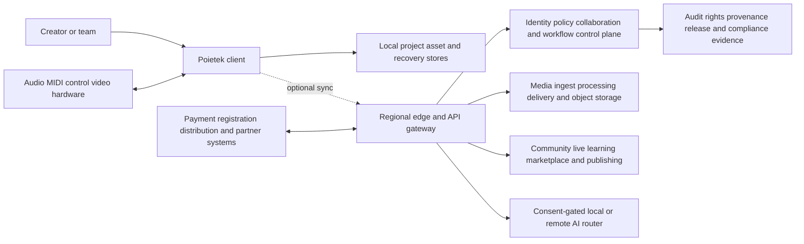
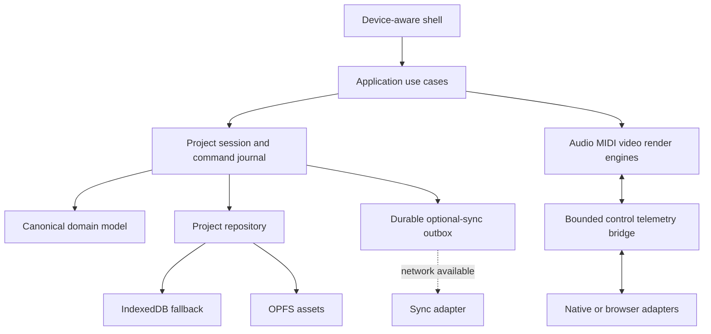
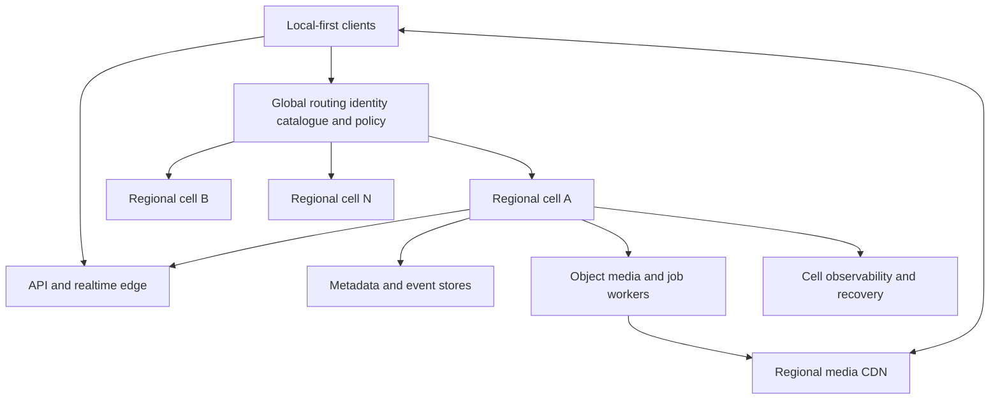

# Poietek Studio scalable system architecture

Status: target architecture with implemented, partial and planned boundaries.
This document is an engineering contract, not a claim that every adapter or
service exists today. Runtime capability reporting and the qualification
catalogue remain the evidence source for what is actually available.

## Architecture outcomes

Poietek is designed as one local-first creative platform that can grow from a
single offline musician to large studios, education estates, broadcasters,
marketplaces and global creator communities without creating incompatible
project formats or making cloud availability a condition of creativity.

The system optimizes for:

1. durable creator ownership and offline usefulness;
2. deterministic, revisioned and portable project truth;
3. real-time safety for audio, MIDI, video and control paths;
4. progressive capability across web, desktop, mobile and dedicated hardware;
5. modular adoption, so users can begin with a DAW and enable collaboration,
   publishing, commerce or AI only when useful;
6. evidence-backed professional claims, releases and external transactions;
7. accessible, international, privacy-preserving operation at mass scale;
8. replaceable providers and open integration boundaries rather than lock-in.

## System context

Solid lines are required local relationships. Dotted lines are optional network
relationships. An unavailable external system must degrade to a truthful queued,
read-only or unavailable state and must not corrupt the local project.

## Architectural principles

### One canonical creative model

`PoietekProject` is the durable aggregate root. Arrangement, media references,
automation, routing, score, picture, rights metadata and release intent evolve
through versioned schemas and migrations. Platform-specific handles, decoded
buffers, sockets, DOM objects, native devices and credentials never enter the
project document.

All mutations use commands with validation, authorization context, revision
identity, undo information and emitted domain events. Long-running work records
intent before execution and completes through idempotent result events.

### Local-first consistency

The local durable commit is the immediate success condition. Each device owns a
local replica, append-only operation journal, asset inventory and recovery
checkpoints. Optional synchronization exchanges immutable content hashes and
causally ordered operations. Conflicts are resolved by domain policy:

- commuting property changes can merge automatically;
- timeline or routing collisions require a visible comparison;
- binary media is immutable and versioned rather than merged;
- rights, payment and release decisions never use silent last-write-wins;
- deletion creates a recoverable tombstone until retention policy expires.

### Ports and adapters

Domain code depends on interfaces, not browsers, Tauri, operating systems or
cloud vendors. Web Audio, WASAPI, Core Audio, ALSA/JACK, MIDI, codecs, plug-in
formats, databases, storage, authentication, payments, AI and distribution are
adapters selected by a capability router. Every adapter reports supported,
configured, permission-required, degraded and unavailable states.

### Cell-based scale

Cloud services, when enabled, use regional cells. Each cell contains API,
collaboration, metadata, workflow and media capacity for a bounded tenant set.
Identity, routing and catalogue services remain small global control-plane
services. Cells reduce blast radius, support data residency and allow horizontal
growth without one global database becoming the platform.

## Logical layers

| Layer | Responsibility | Dependency rule |
| --- | --- | --- |
| Experience | Arrange, Rack, console, setup, handheld, accessibility and learning | Calls application use cases only |
| Application | Commands, queries, sessions, workflows, authorization and orchestration | Depends on domain and ports |
| Domain | Project, timeline, assets, routing, rights, releases and invariant logic | No UI, network or platform dependencies |
| Real-time engines | Audio graph, transport, MIDI, video clock, render graph and telemetry | Lock-free bounded communication with control plane |
| Adapters | Browser/native devices, persistence, codecs, plug-ins and providers | Implements declared ports |
| Platform services | Collaboration, media, community, commerce, publishing and AI routing | Optional; consumes versioned contracts |
| Operations | Observability, deployment, policy, evidence, security and recovery | Cannot bypass product authorization |

Dependencies point inward. Cross-domain integration uses versioned events or
explicit application contracts, not direct access to another module's database.

## Client runtime

The UI may hold projections and transient selection state, but never the only
copy of creative truth. Expensive decoding, waveform generation, analysis and
rendering execute in workers or native services. The real-time callback uses
preallocated memory, bounded queues and immutable snapshots; it performs no
network, database, logging, allocation or unbounded locking.

## Domain boundaries

The modular monolith is the default deployment. Boundaries can later become
services only when scaling, isolation, ownership or regulatory needs justify the
operational cost.

| Domain | Owns | Publishes |
| --- | --- | --- |
| Project | schema, revisions, commands, undo/redo, branches | project revision events |
| Asset | hashes, local replicas, proxies, retention and lineage | asset availability events |
| Production | timeline, automation, routing, score and render intent | edit and render events |
| Device | capabilities, negotiation and measured telemetry | device state and xrun evidence |
| Collaboration | memberships, presence, operations and conflict cases | collaboration events |
| Identity and policy | accounts, organizations, roles, consent and sessions | security and consent events |
| Rights and provenance | contributors, claims, licences, evidence and disputes | rights-state events |
| Release and publishing | packages, QC, registrations and delivery evidence | release-state events |
| Community and live | feed, messaging, moderation, live sessions and discovery | community safety events |
| Commerce | catalogue, orders, entitlements, payouts, tax evidence | financial state events |
| AI | models, policies, consent, requests, lineage and acceptance | AI provenance events |
| Learning | curricula, progress, classrooms and certification evidence | learning events |

## Data architecture

### Storage classes

- Project documents: small, versioned, strongly validated and locally durable.
- Operation journals: append-only, ordered, compactable and replayable.
- Media objects: immutable, content-addressed, chunked and independently replicated.
- Search projections: disposable indexes rebuilt from authoritative events.
- Presence and meters: ephemeral streams with bounded retention.
- Evidence records: append-only, access-controlled and retention governed.
- Secrets: operating-system or managed secret stores, never project files or the
  browser bundle.

Every record carries schema version, stable identity, tenant/project scope,
creation and modification metadata, and—where required—purpose, consent,
residency, retention and legal-hold classifications.

### Synchronization protocol

The sync protocol is resumable and idempotent. It negotiates schema and feature
versions, exchanges revision/vector summaries, uploads missing content chunks,
then applies authorized operations. Hashes verify content integrity. Encryption
protects transport and stored remote objects. End-to-end encrypted collaboration
can be supported for eligible workflows, with explicit loss of server-side
search/moderation features rather than misleading guarantees.

## API and integration architecture

Human clients use versioned HTTPS APIs for commands and queries, WebSocket or
WebTransport channels for presence/collaboration, and signed resumable transfers
for media. Internal asynchronous integration uses a durable event bus and
transactional outbox. Partners receive scoped OAuth/OIDC access, webhooks with
signature verification and replay protection, quotas, idempotency keys and an
auditable developer console.

Contract evolution is additive by default. Breaking changes require a new major
version, migration tooling, telemetry proving remaining usage, a published
deprecation window and tested rollback. Generated SDKs never expose internal
database models directly.

## Security and privacy architecture

Trust boundaries exist between UI and native bridge, client and edge, tenant and
tenant, control and media planes, real-time and general-purpose threads, plug-ins
and host, AI providers and projects, and Poietek and external authorities.

Required controls include:

- least-privilege capabilities and deny-by-default native commands;
- phishing-resistant administrator authentication and short-lived sessions;
- organization roles plus resource and action attributes;
- tenant isolation at API, job, cache, object and database layers;
- signed artifacts, SBOMs, provenance attestations and dependency scanning;
- plug-in and codec sandboxing, quarantine and crash recovery;
- encryption in transit and at rest with key rotation and separation of duties;
- consent and purpose limitation for telemetry, AI, collaboration and marketing;
- export, deletion, retention, legal hold and regional residency workflows;
- immutable security/audit evidence with privacy-aware redaction;
- abuse prevention, rate limiting and safe media parsing at every public ingress.

Threat models cover project/media parsing, native bridges, plug-ins, collaboration,
live streaming, marketplace supply chain, payment abuse, account takeover,
moderation evasion, prompt injection and model/data exfiltration.

## Reliability and performance

Service objectives are defined per user journey, not as one platform uptime
number. Local edit/save remains available during network outages. Cloud examples
include sync durability, collaboration join latency, media ingest success, live
playback start, checkout correctness and notification delivery.

Each operation carries a correlation ID from client intent through jobs and
external callbacks. Metrics, structured logs and traces exclude creative content
and personal data by default. Synthetic probes, canaries and regional health
checks feed automated rollback. Capacity uses load shedding and priority tiers:
project durability and active sessions outrank feeds, recommendations and batch
AI. Backpressure is visible; queues have age/size alarms and dead-letter review.

Backups are encrypted and restore-tested. Recovery objectives are documented by
data class. Cell evacuation, region loss, corrupt migration, compromised signing
key and provider failure are exercised through game days before public scale.

## Media and real-time architecture

Interactive audio and MIDI stay on the device whenever possible. Native engines
negotiate hardware formats, maintain a stable callback, report measured xruns and
use sample-clock-derived transport. Offline rendering reuses the same processing
semantics and produces reproducibility metadata.

Video/media jobs use an explicit pipeline: probe, validate, decode, proxy,
analyze, edit/render, encode, package and QC. Each stage is cancellable,
idempotent and content-hash keyed. Workers declare codec, GPU, memory, licence and
regional constraints. Unsupported or restricted codecs remain unavailable.

Live distribution separates ingest, transcode, origin, CDN and audience control.
Latency mode, captions, moderation, recording, rights windows and failover are
explicit session policies. No UI timer is represented as sample-accurate or
frame-accurate evidence.

## AI architecture

AI is an optional capability behind a provider-neutral router. Policy evaluates
project sensitivity, consent, rights, age, region, organization rules, model
capability, data retention and cost before dispatch. Local models are preferred
where practical. Remote requests use minimal scoped inputs, redaction and
short-lived credentials.

AI results are suggestions or preview artifacts until the creator explicitly
accepts an undoable command. The system records model/provider version, input
asset lineage, policy decision, generation parameters, output hash and acceptance
state without inventing copyright or ownership. Provider failure never blocks
manual production.

## Adoption and extensibility

Mass adoption depends on graceful entry points: anonymous local creation,
optional accounts, import/export standards, portable settings, keyboard and
touch parity, low-bandwidth modes, localization, assistive technology and
progressive disclosure from beginner to professional surfaces.

Extensions use signed manifests, semantic capabilities, explicit permissions,
resource budgets, isolated execution and versioned project state. Unsupported
extensions preserve state and can use frozen/rendered fallbacks. Proprietary SDKs
are added only under valid licences and never become requirements for opening a
project.

## Deployment topology

Infrastructure is declarative and promoted through development, preview,
staging and production with policy checks. Databases use expand/migrate/contract
changes. Releases are feature-flagged by capability and tenant, use canaries,
and retain a tested rollback. Desktop/mobile builds are reproducible, signed in
protected environments and distributed only after platform acceptance evidence.

## Governance and decision records

Material architectural decisions use ADRs containing context, decision,
alternatives, consequences, migration and rollback. Domain and data owners are
explicit. Architecture fitness tests enforce dependency direction, schema
compatibility, serialization, capability honesty, security configuration and
documentation coverage.

No subsystem advances from foundation to production-ready without evidence for:

1. functional and invariant tests;
2. performance and capacity limits;
3. security and privacy review;
4. accessibility and internationalization acceptance where user-facing;
5. failure, recovery and rollback behavior;
6. observability and support runbooks;
7. licence, rights and external-provider acceptance;
8. representative device, hardware and regional testing.

## Evolution sequence

1. Stabilize canonical project, local persistence, recovery and desktop audio.
2. Complete revisioned production edits, MIDI and deterministic offline render.
3. Add codec/video and plug-in boundaries with sandboxing and QC evidence.
4. Introduce opt-in identity and synchronization without weakening offline use.
5. Add collaboration cells and conflict workflows for invited teams.
6. Add community/live, rights, publishing and commerce as separately operated domains.
7. Expand regions, residency controls, partner APIs and extension governance.
8. Optimize cells, media pipelines and operations using measured adoption data.

This sequence keeps architectural ambition separate from implementation claims:
each capability remains `unavailable`, `foundation`, `partial`, `verified` or
`externally_gated` until its acceptance evidence exists.
