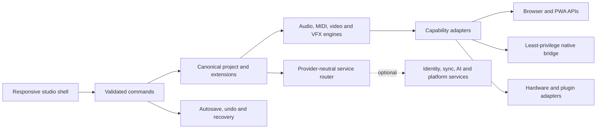

# Volume 02 — Software Architecture

Document ID: `POI-VOL-02`
Edition: `1.0.0`
Primary domains: `DOM-FEATURE`, `DOM-DATA`, `DOM-API`, `DOM-DEVELOPER`

## Architectural style

Poietek uses a local-first, capability-gated, modular architecture. The canonical
project and pure commands form the stable centre. Browser, native, hardware,
provider and cloud integrations attach through explicit adapters and may become
unavailable without invalidating project data.

## Layer responsibilities

| Layer | Owns | Must not own |
| --- | --- | --- |
| Domain core | Project schema, validation, migrations and extension envelopes | Browser handles, provider clients, secrets or UI state |
| Application | Commands, sessions, autosave, undo, orchestration and status | Rendering details or external acceptance claims |
| Media engines | Real-time/offline audio, waveform, recording, MIDI, video/VFX jobs | Project persistence policy or remote identity |
| Capability adapters | Web/native/device/plugin/provider observations and operations | Promotion of unverified capability state |
| Presentation | Screens, menus, settings, control feedback and accessibility | Direct durable-state mutation |
| Remote platform | Identity, sync, teams, rights, publishing, community and commerce | Ownership of the canonical creative format |

## Production source boundaries

`src/poietek/` is the production architecture. `domain`, `project`, `assets`,
`audio`, `timeline`, `capture`, `export`, `recovery`, `health`, `release`,
`settings`, `providers`, `hardware`, `platform`, `community`, `ai`, `deployment`,
`vision`, `pwa` and `react` each have explicit ownership. Legacy SDS rack modules
remain presentation/prototype surfaces while durable behaviors migrate through
canonical commands.

## Core invariants

- Project JSON is versioned, validated and free of runtime handles.
- Commands are atomic, deterministic where possible and undoable when material.
- Saves are serialized; recovery snapshots remain separate from durable saves.
- Media uses content identity and metadata; large bytes are stored outside project
  JSON.
- Unknown extensions are preserved or reported unsupported, never guessed.
- Capability state records its source, evidence and observation time.
- Remote success never substitutes for a required local durable commit.
- External side effects use idempotency, receipts and explicit pending/failure
  states.

## Cross-platform strategy

The React application and canonical core are shared. Browser/PWA uses Web Audio,
Web MIDI, MediaRecorder, IndexedDB and OPFS when available. Tauri supplies only
approved native file, credential, device, plugin and packaging operations.
Android/iOS shells reuse the core but provide platform audio-session, permission,
interruption and lifecycle adapters. Platform limits remain visible.

## Quality attributes

- Resilience: local continuation, retries, recovery, conflict isolation and
  recoverable missing dependencies.
- Performance: lazy workspaces, code splitting, waveform caching, virtualization,
  workers and explicit large-project budgets.
- Security: narrow trust boundaries, no browser secrets, validation at every
  boundary and least-privilege native commands.
- Testability: pure command/core tests, adapter contracts, deterministic fixtures
  and evidence-backed physical/platform matrices.
- Evolvability: versioned schemas, extension envelopes, deprecation policy and
  provider-neutral interfaces.

## Architecture decision process

Material decisions receive an identifier, context, choice, alternatives,
consequences, migration plan and affected requirement IDs. A decision that
changes project compatibility, privacy, rights, security, native privileges or a
public SDK requires cross-volume review and migration fixtures.

## Acceptance evidence

Architecture is accepted through full typecheck, strict core compilation, schema
and migration fixtures, command tests, dependency-boundary review, security
threat modeling, recovery tests, performance budgets and platform-specific
adapter evidence. Current detailed source map is in `../ARCHITECTURE.md`.

## Current status

The canonical core, local persistence/assets, project session, audio vertical
slice, capability routers, versioned platform extensions, responsive shell, PWA
build and least-privilege native scaffold implement the architecture direction.
Remote services, mature native adapters, public SDKs and specialist media/plugin
engines remain phase gated and must preserve these boundaries.
