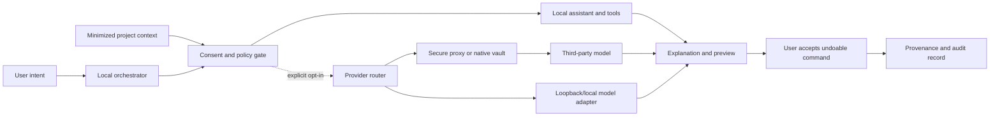

# Volume 06 — AI System Architecture

Document ID: `POI-VOL-06`
Edition: `1.0.0`
Primary domains: `CAP-10`, `DOM-AI`, `DOM-SECURITY`, `DOM-LEARNING`

## Design objective

Poietek has an independent local studio brain as its private default. Users may
optionally configure approved third-party or custom models for particular tasks.
The router treats provider names as adapter choices, not endorsement or proof of
availability. Model access remains at the user's discretion and within explicit
data, cost, permission and retention policies.

## Architecture

## Provider families

The catalog supports Poietek local, OpenAI-compatible, Anthropic-compatible,
Gemini-compatible, xAI-compatible, DeepSeek-compatible, Moonshot/Kimi-compatible,
Copilot-style, Manus-style, Hugging Face, Ollama/local endpoints and custom
modules. Exact API support depends on configured adapters, licences, terms,
region, credentials and current provider behavior. Browser bundles never contain
raw provider secrets.

## Assistant modes and tools

Modes include project guidance, composition, recording, editing, mix, mastering
preflight, sampling, MIDI, hardware setup, video/VFX, rights, publishing,
learning and troubleshooting. Tools are narrow, schema-validated capabilities:
read project summary, inspect selected items, analyze decoded PCM, search local
assets, propose commands, prepare metadata or start an external job. Rights
acceptance, payments, publishing and destructive filesystem operations cannot be
granted through a generic creative tool.

## Context, memory and privacy

- Context is purpose-limited and minimized per request.
- Local operation is default; remote access requires enabled global policy and
  request consent according to user settings.
- Provider configuration stores credential references, not credential values.
- Conversation/project memory has visible scope, retention and delete controls.
- Private media is not uploaded merely to answer metadata or workflow questions.
- Provider input/output, model/version, consent, tools and accepted actions are
  attributable where policy permits.

## Action lifecycle

1. Interpret intent and expose ambiguity.
2. Check user permission, platform capability and destination requirements.
3. Select the local path or obtain consent for an allowed provider route.
4. Validate model/tool input and output against schemas.
5. Explain findings, uncertainty, required evidence and proposed changes.
6. Preview the material result where feasible.
7. Require user acceptance.
8. Apply an undoable command or start an auditable external job.
9. Record provenance without claiming authorship or legal validity.

## Evaluation and safety

Suites cover prompt injection, tool escalation, data exfiltration, secret leakage,
unsafe content, hallucinated measurements, invented rights/payment states,
provider outage, cost limits, latency, accessibility, usefulness and undo. AI
must not call RMS LUFS, sample peak dBTP, name matching verified hardware, or a
tempo-changing process time-preserving pitch.

## Current status and acceptance

The local assistant, requested provider catalog, configuration validation,
consent-oriented settings and provider-neutral contracts are operational or
foundational. Remote inference adapters, secure service proxy, advanced local
models, generative media engines and automated actions remain configuration or
phase gated. Acceptance requires provider contract tests, red-team/evaluation
evidence, data-egress review, cost controls, provenance and verified undo.
