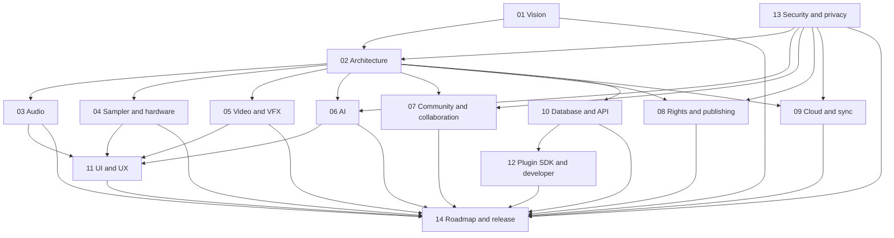

# Poietek Studio professional specification series

Series ID: `POI-SERIES-001`
Edition: `1.0.0`
Status: controlled living documentation

This series publishes the Poietek/SDS product definition as fourteen professional
volumes. `../POIETEK_MASTER_SPECIFICATION.md` remains the controlling index. The
volumes provide audience-specific detail and must not contradict validated code,
tests, capability observations or the master status vocabulary.

## Volume index

| Volume | Document | Principal ownership |
| --- | --- | --- |
| 01 | [Vision & White Paper](01_VISION_WHITE_PAPER.md) | Mission, philosophy, value, users, ecosystem and success measures |
| 02 | [Software Architecture](02_SOFTWARE_ARCHITECTURE.md) | Boundaries, modules, commands, events, native/web split and quality attributes |
| 03 | [Audio Production System](03_AUDIO_PRODUCTION_SYSTEM.md) | Recording, arranging, editing, mixing, analysis, mastering and export |
| 04 | [Sampler & Hardware Integration](04_SAMPLER_HARDWARE_INTEGRATION.md) | Sampling, MIDI, controllers, consoles, routing, clocking and evidence |
| 05 | [Video & VFX System](05_VIDEO_VFX_SYSTEM.md) | Picture editing, captions, colour, compositing, render jobs and delivery |
| 06 | [AI System Architecture](06_AI_SYSTEM_ARCHITECTURE.md) | Local assistant, optional providers, custom models, tools, consent and evaluation |
| 07 | [Community & Collaboration Platform](07_COMMUNITY_COLLABORATION_PLATFORM.md) | Replicas, teams, review, social media hub, moderation and learning |
| 08 | [Rights, Licensing & Publishing](08_RIGHTS_LICENSING_PUBLISHING.md) | Contributors, splits, evidence, licences, registrations, releases and royalties |
| 09 | [Cloud & Synchronisation](09_CLOUD_SYNCHRONISATION.md) | Optional remote storage, replicas, conflict handling, queues and resilience |
| 10 | [Database & API Specification](10_DATABASE_API_SPECIFICATION.md) | Canonical data, local stores, remote schema, commands, APIs and webhooks |
| 11 | [Desktop, Mobile & Web UI/UX](11_DESKTOP_MOBILE_WEB_UI_UX.md) | Screens, menus, settings, controls, responsive behavior and accessibility |
| 12 | [Plugin SDK & Developer Documentation](12_PLUGIN_SDK_DEVELOPER_DOCUMENTATION.md) | Plugin hosting, extension contracts, SDK packages, tools and compatibility |
| 13 | [Security & Privacy](13_SECURITY_PRIVACY.md) | Threat model, least privilege, encryption, consent, compliance and incident response |
| 14 | [Roadmap & Release Plan](14_ROADMAP_RELEASE_PLAN.md) | P0-P10 sequencing, release trains, evidence gates and lifecycle |

## Control rules

1. Every requirement keeps a stable `CAP`, `DOM`, `PHI`, `WF`, `SCR`, `SET`,
   `SEC` or phase identifier from the controlled specification set.
2. Every material capability states whether it is operational, foundation,
   prototype, planned, external-gate, unavailable or retired.
3. A user interface, contract, provider configuration or simulator is not proof
   that an external or native capability works.
4. Shared definitions are linked instead of copied when duplication could cause
   status or schema drift.
5. Changes to one volume trigger review of its dependencies and the automated
   documentation-coverage test.

## Cross-volume dependency map

## Source and companion documents

- `../POIETEK_MASTER_SPECIFICATION.md` — controlling product definition.
- `../UI_SCREEN_WORKFLOW_CATALOG.md` — canonical screen/control inventory.
- `../PLATFORM_DATA_API_SECURITY_BLUEPRINT.md` — detailed platform blueprint.
- `../DELIVERY_TEST_DOCUMENTATION_PLAN.md` — platform and evidence plan.
- `../SDS_VISION_COVERAGE.md` — historical SDS source traceability.
- `../BUILD_STATUS.md` — verified implementation status.
